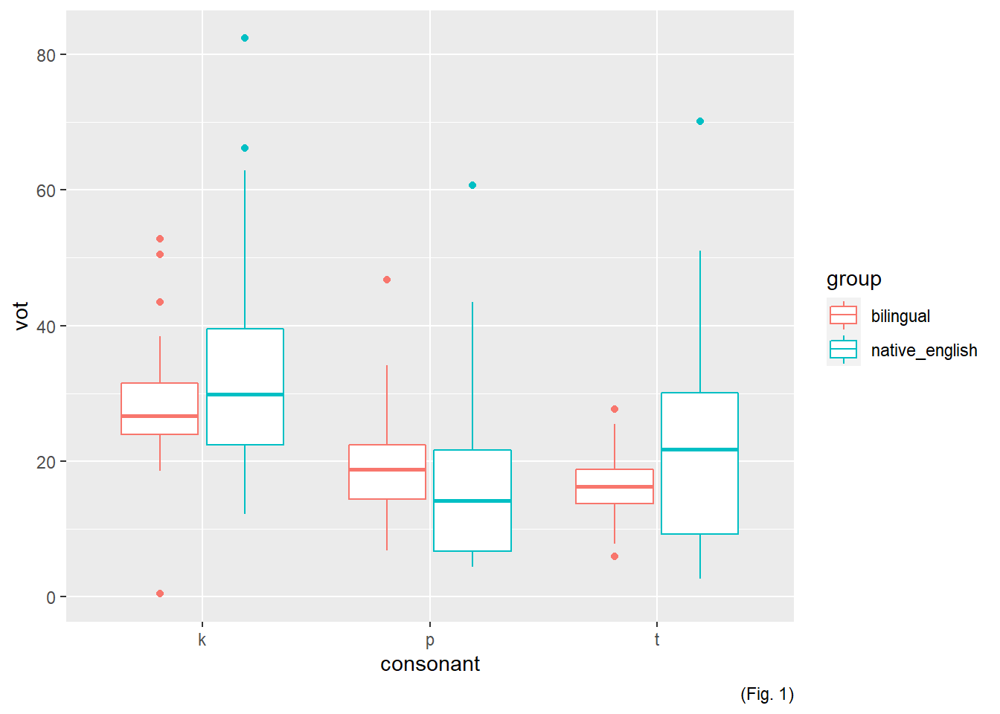
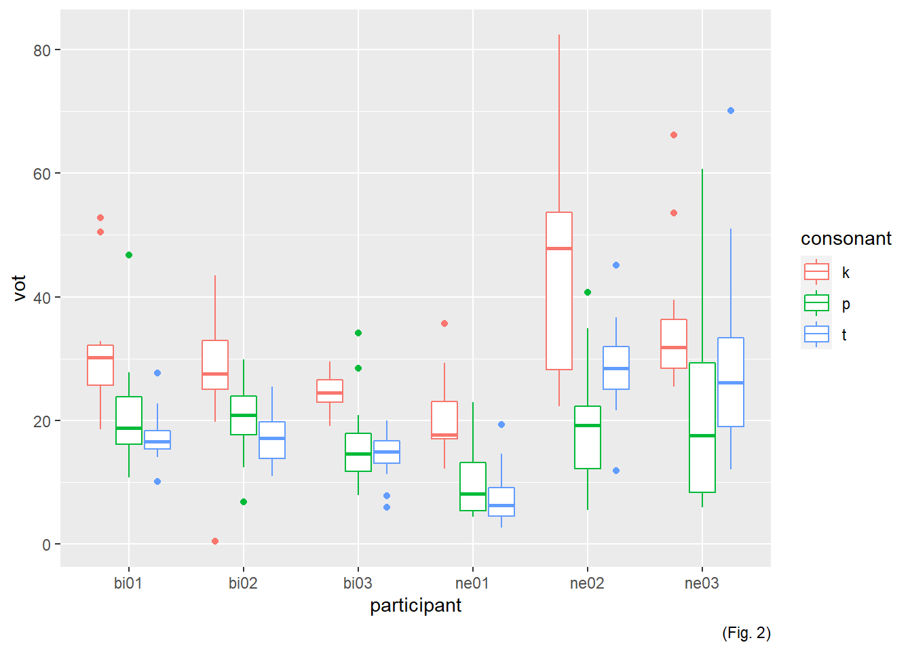

Programming assignment 4
================

**Author**: Parrish **Date**: Last update: 2020-04-23 11:49:49

# Overview

<!-- 
  Talk brielfy about what you did here 
  Describe your hypotheses
-->

My hypothesis is that non-native speakers (ne groups) of Spanish will
have a longer lag VOT for word-initial stop consonants than native
speakers of Spanish (bi groups) in their production of Spanish-like
pseudowords, due to the greater influence of English from the native
English speakers.

# Prep

## Libraries

``` r
# Load libraries here

library(tidyverse)
library(untidydata)
library(ggplot2)
library(readr)
library(dplyr)
```

## Load data

``` r
bi01 <- read_csv("../data/bi01.csv")
```

    ## Warning: Missing column names filled in: 'X6' [6]

    ## Parsed with column specification:
    ## cols(
    ##   fileID = col_character(),
    ##   participant = col_character(),
    ##   f1 = col_double(),
    ##   f2 = col_double(),
    ##   vot = col_double(),
    ##   X6 = col_character()
    ## )

``` r
bi02 <- read_csv("../data/bi02.csv")
```

    ## Warning: Missing column names filled in: 'X6' [6]

    ## Parsed with column specification:
    ## cols(
    ##   fileID = col_character(),
    ##   participant = col_character(),
    ##   f1 = col_double(),
    ##   f2 = col_double(),
    ##   vot = col_double(),
    ##   X6 = col_logical()
    ## )

``` r
bi03 <- read_csv("../data/bi03.csv")
```

    ## Warning: Missing column names filled in: 'X6' [6]

    ## Parsed with column specification:
    ## cols(
    ##   fileID = col_character(),
    ##   participant = col_character(),
    ##   f1 = col_double(),
    ##   f2 = col_double(),
    ##   vot = col_double(),
    ##   X6 = col_logical()
    ## )

``` r
ne01 <- read_csv("../data/ne01.csv")
```

    ## Warning: Missing column names filled in: 'X6' [6]

    ## Parsed with column specification:
    ## cols(
    ##   fileID = col_character(),
    ##   participant = col_character(),
    ##   f1 = col_double(),
    ##   f2 = col_double(),
    ##   vot = col_double(),
    ##   X6 = col_logical()
    ## )

``` r
ne02 <- read_csv("../data/ne02.csv")
```

    ## Warning: Missing column names filled in: 'X6' [6]

    ## Parsed with column specification:
    ## cols(
    ##   fileID = col_character(),
    ##   participant = col_character(),
    ##   f1 = col_double(),
    ##   f2 = col_double(),
    ##   vot = col_double(),
    ##   X6 = col_logical()
    ## )

``` r
ne03 <- read_csv("../data/ne03.csv")
```

    ## Warning: Missing column names filled in: 'X6' [6]

    ## Parsed with column specification:
    ## cols(
    ##   fileID = col_character(),
    ##   participant = col_character(),
    ##   f1 = col_double(),
    ##   f2 = col_double(),
    ##   vot = col_double(),
    ##   X6 = col_logical()
    ## )

## Tidy data

``` r
bilinguals = rbind(bi01,bi02,bi03)
native_english = rbind(ne01,ne02,ne03)

bilinguals[c(1:15, 46:60, 91:105), "consonant"] = "k"
bilinguals[c(16:30, 61:75, 106:120), "consonant"] = "p"
bilinguals[c(31:45, 76:90, 121:135), "consonant"] = "t"
bilinguals[c(1:135), "group"] = "bilingual"

native_english[c(1:15, 46:60, 91:105), "consonant"] = "k"
native_english[c(16:30, 61:75, 106:120), "consonant"] = "p"
native_english[c(31:45, 76:90, 121:135), "consonant"] = "t"
native_english[c(1:135), "group"] = "native_english"

bilinguals <- bilinguals[-c(3,4,6)]
native_english <- native_english[-c(3,4,6)]

allgroups = rbind(bilinguals,native_english)


bi01 = bi01[-15,]
bilinguals = bilinguals[-15,]
allgroups = allgroups[-15,]
```

# Analysis

## Descriptives

``` r
# Give some descriptive summaries of your data 
# Display your descriptives in a table


filter
```

    ## function (.data, ..., .preserve = FALSE) 
    ## {
    ##     UseMethod("filter")
    ## }
    ## <bytecode: 0x0000000015a71dd8>
    ## <environment: namespace:dplyr>

``` r
mean_vot_bi01 <- mean(bi01$vot)
mean_vot_bi02 <- mean(bi02$vot)
mean_vot_bi03 <- mean(bi03$vot)
mean_vot_ne01 <- mean(ne01$vot)
mean_vot_ne02 <- mean(ne02$vot)
mean_vot_ne03 <- mean(ne03$vot)
mean_vot_bilinguals <- mean(bilinguals$vot)
mean_vot_native_english <- mean(bilinguals$vot)

Mean_vot_bilinguals = rbind(mean_vot_bi01,mean_vot_bi02,mean_vot_bi03)
Mean_vot_native_english = rbind(mean_vot_ne01,mean_vot_ne02,mean_vot_ne03)

standard_deviation_bi01 = sd(bi01$vot)
standard_deviation_bi02 = sd(bi02$vot)
standard_deviation_bi03 = sd(bi03$vot)
standard_deviation_ne01 = sd(ne01$vot)
standard_deviation_ne02 = sd(ne02$vot)
standard_deviation_ne03 = sd(ne03$vot)

standard_deviation_all = rbind(standard_deviation_bi01,standard_deviation_bi02,standard_deviation_bi03,standard_deviation_ne01,standard_deviation_ne02,standard_deviation_ne03)


standard_deviation_native_english <- sd(native_english$vot)
standard_deviation_bilinguals <- sd(bilinguals$vot)

means_all_bilinguals = rbind(mean_vot_bi01,mean_vot_bi02,mean_vot_bi03)
means_all_native_english = rbind(mean_vot_ne01,mean_vot_ne02,mean_vot_ne03)


##Mean VOT per bilingual participant 

knitr::kable(Mean_vot_bilinguals, caption = "Table 1 - Mean VOT of bilinguals")
```

|                 |          |
| :-------------- | -------: |
| mean\_vot\_bi01 | 22.98114 |
| mean\_vot\_bi02 | 21.94378 |
| mean\_vot\_bi03 | 18.40311 |

Table 1 - Mean VOT of bilinguals

``` r
##Mean VOT per native english participant
knitr::kable(Mean_vot_native_english, caption = "Table 2 - Mean VOT of Native English speakers")
```

|                 |          |
| :-------------- | -------: |
| mean\_vot\_ne01 | 12.71444 |
| mean\_vot\_ne02 | 30.58800 |
| mean\_vot\_ne03 | 28.69200 |

Table 2 - Mean VOT of Native English speakers

``` r
## Standard Deviation per participant


knitr::kable(standard_deviation_all, caption = "Table 3 - Standard Deviation of all participants")
```

|                           |           |
| :------------------------ | --------: |
| standard\_deviation\_bi01 |  9.607135 |
| standard\_deviation\_bi02 |  8.247008 |
| standard\_deviation\_bi03 |  6.649617 |
| standard\_deviation\_ne01 |  7.846749 |
| standard\_deviation\_ne02 | 15.824477 |
| standard\_deviation\_ne03 | 15.017324 |

Table 3 - Standard Deviation of all participants

``` r
##Mean VOT per letter per group

knitr::kable
```

    ## function (x, format, digits = getOption("digits"), row.names = NA, 
    ##     col.names = NA, align, caption = NULL, label = NULL, format.args = list(), 
    ##     escape = TRUE, ...) 
    ## {
    ##     if (missing(format) || is.null(format)) 
    ##         format = getOption("knitr.table.format")
    ##     if (is.null(format)) 
    ##         format = if (is.null(pandoc_to())) 
    ##             switch(out_format() %n% "markdown", latex = "latex", 
    ##                 listings = "latex", sweave = "latex", html = "html", 
    ##                 markdown = "markdown", rst = "rst", stop("table format not implemented yet!"))
    ##         else if (isTRUE(opts_knit$get("kable.force.latex")) && 
    ##             is_latex_output()) {
    ##             "latex"
    ##         }
    ##         else "pandoc"
    ##     if (is.function(format)) 
    ##         format = format()
    ##     if (!missing(align) && length(align) == 1L && !grepl("[^lcr]", 
    ##         align)) 
    ##         align = strsplit(align, "")[[1]]
    ##     if (is.null(label)) 
    ##         label = opts_current$get("label")
    ##     if (!is.null(caption) && !is.na(caption)) 
    ##         caption = paste0(create_label("tab:", label, latex = (format == 
    ##             "latex")), caption)
    ##     if (inherits(x, "list")) {
    ##         if (format == "pandoc" && is_latex_output()) 
    ##             format = "latex"
    ##         res = lapply(x, kable, format = format, digits = digits, 
    ##             row.names = row.names, col.names = col.names, align = align, 
    ##             caption = NA, format.args = format.args, escape = escape, 
    ##             ...)
    ##         res = unlist(lapply(res, one_string))
    ##         res = if (format == "latex") {
    ##             kable_latex_caption(res, caption)
    ##         }
    ##         else if (format == "html" || (format == "pandoc" && is_html_output())) 
    ##             kable_html(matrix(paste0("\n\n", res, "\n\n"), 1), 
    ##                 caption = caption, escape = FALSE, table.attr = "class=\"kable_wrapper\"")
    ##         else {
    ##             res = paste(res, collapse = "\n\n")
    ##             if (format == "pandoc") 
    ##                 kable_pandoc_caption(res, caption)
    ##             else res
    ##         }
    ##         return(structure(res, format = format, class = "knitr_kable"))
    ##     }
    ##     if (!is.matrix(x)) 
    ##         x = as.data.frame(x)
    ##     if (identical(col.names, NA)) 
    ##         col.names = colnames(x)
    ##     m = ncol(x)
    ##     isn = if (is.matrix(x)) 
    ##         rep(is.numeric(x), m)
    ##     else sapply(x, is.numeric)
    ##     if (missing(align) || (format == "latex" && is.null(align))) 
    ##         align = ifelse(isn, "r", "l")
    ##     digits = rep(digits, length.out = m)
    ##     for (j in seq_len(m)) {
    ##         if (is_numeric(x[, j])) 
    ##             x[, j] = round(x[, j], digits[j])
    ##     }
    ##     if (any(isn)) {
    ##         if (is.matrix(x)) {
    ##             if (is.table(x) && length(dim(x)) == 2) 
    ##                 class(x) = "matrix"
    ##             x = format_matrix(x, format.args)
    ##         }
    ##         else x[, isn] = format_args(x[, isn], format.args)
    ##     }
    ##     if (is.na(row.names)) 
    ##         row.names = has_rownames(x)
    ##     if (!is.null(align)) 
    ##         align = rep(align, length.out = m)
    ##     if (row.names) {
    ##         x = cbind(` ` = rownames(x), x)
    ##         if (!is.null(col.names)) 
    ##             col.names = c(" ", col.names)
    ##         if (!is.null(align)) 
    ##             align = c("l", align)
    ##     }
    ##     n = nrow(x)
    ##     x = replace_na(to_character(as.matrix(x)), is.na(x))
    ##     if (!is.matrix(x)) 
    ##         x = matrix(x, nrow = n)
    ##     x = trimws(x)
    ##     colnames(x) = col.names
    ##     if (format != "latex" && length(align) && !all(align %in% 
    ##         c("l", "r", "c"))) 
    ##         stop("'align' must be a character vector of possible values 'l', 'r', and 'c'")
    ##     attr(x, "align") = align
    ##     res = do.call(paste("kable", format, sep = "_"), list(x = x, 
    ##         caption = caption, escape = escape, ...))
    ##     structure(res, format = format, class = "knitr_kable")
    ## }
    ## <bytecode: 0x0000000012166460>
    ## <environment: namespace:knitr>

## Visualization

``` r
#Include some plots here

## VOT Boxplot for both bilingual and Native English groups

ggplot(data = allgroups, aes(x = consonant, y = vot, color = group)) + geom_boxplot() + labs(caption = "(Fig. 1)")
```



``` r
ggplot(data = allgroups, aes(x = participant, y = vot, color = consonant)) + geom_boxplot()  + labs(caption = "(Fig. 2)")
```



<!-- 
Include a professional looking figure illustrating an example of the acoustics 
of the production data.
You decide what is relevant (something related to your hypothesis). 
Think about where this file should be located in your project. 
What location makes most sense in terms of organization? 
How will you access the file (path) from this .Rmd file?
If you need help consider the following sources: 
  - Search 'Rmarkdown image' on google, stackoverflow, etc.
  - Search the 'knitr' package help files in RStudio
  - Search the internet for HTML code (not recommended, but it works)
  - Check the code from my class presentations (may or may not be helpful)
-->

## Hypothesis test

``` r
# Conduct a simple statistical analysis here (optional)
```

–\>

The original hypothesis (that L2 learners have a longer lag VOT than
Spanish native speakers) seems to be supported on average by the data.
The Figure 1 and tables 1-3 show that the average VOT for the NE group
is longer than the BI group.

The consonant P and the participant NE01

The consonant P data does not corroborate my prediction. Figure 1 shows
that the NE and BI groups both have similar VOT for word initial p-
Spanish psuedowords (around 20 seconds). However, the BI group has less
varation overall in all consonants (table 3).

Individual differences are also evident (figure 2) in the NE group. NE01
appeared to produce stop consonants in a more native-like manner than
NE02 and NE03. A larger data set could aid in the ability to distinguish
whether NE01 is an outlier in general, or if differences in Spanish
proficiency could explain the production differences between NE01 and
NE02 and NE03.

*Note* An outlier was removed from Bi01 data, on the basis that the
recording was muffled, and the word-initial stop was not heard, not
measureable on the waveform/spectrogram.

# Conclusion

<!-- 
Revisit your hypotheses (refer to plots, figures, tables, statistical tests, 
etc.)

Reflect on the entire process. 
What did you enjoy? What did you hate? What did you learn? 
What would you do differently?
-->

On average, native Spanish speakers produced word initial stops with a
shorter lag VOT than native speakers of English who speak Spanish as a
second language. Individual differences were noted in the NE (native
English) group, and more data is needed to better explain the potential
cause of the differences in NE group.

</br></br>
